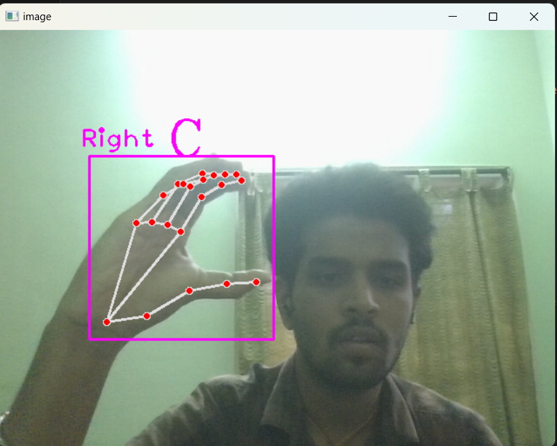
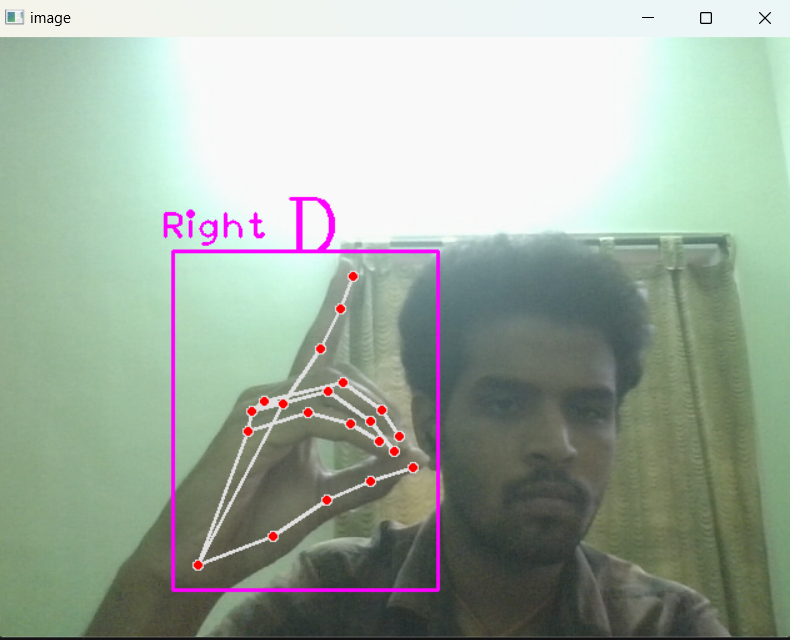

# sign-language-recognition-system
# Hand Gesture Recognition with Voice Feedback

This project implements a real-time hand gesture recognition system using a webcam, with the ability to collect gesture image data and test recognition using a pre-trained deep learning model. It also provides audio feedback using text-to-speech.



## Features

- Collect hand gesture images for training a custom classifier.
- Real-time hand gesture recognition using a webcam.
- Voice feedback of detected gestures using `pyttsx3`.
- Uses `cvzone` modules for hand detection and classification.

## Requirements

- Python 3.x
- OpenCV (`cv2`)
- NumPy
- [cvzone](https://github.com/cvzone/cvzone)
- pyttsx3 (for text-to-speech)

Install dependencies using:

```bash
pip install opencv-python numpy cvzone pyttsx3

